# Aula 1: Python para Ciência de Dados

## 📋 Índice
1. [Introdução à Linguagem e Motivação](#1-introdução-à-linguagem-e-motivação)
2. [Arquitetura Interna do Python](#2-arquitetura-interna-do-python)
3. [Fundamentos da Linguagem](#3-fundamentos-da-linguagem)
4. [Ambiente e Ecossistema](#4-ambiente-e-ecossistema)
5. [Python para Ciência de Dados](#5-python-para-ciência-de-dados)
6. [Encerramento e Próximos Passos](#6-encerramento-e-próximos-passos)

---

## 1. Introdução à Linguagem e Motivação

### 1.1 O que é Python?

**Python** é uma linguagem de programação de alto nível, interpretada e de propósito geral, criada por Guido van Rossum em 1991.

#### Filosofia Python (The Zen of Python)
- **Legibilidade conta**: código claro é melhor que código obscuro
- **Simples é melhor que complexo**
- **Explícito é melhor que implícito**
- **Deve haver uma — e preferencialmente só uma — maneira óbvia de fazer algo**

```python
# Para ver o Zen completo:
import this
```

### 1.2 Por que usar Python?

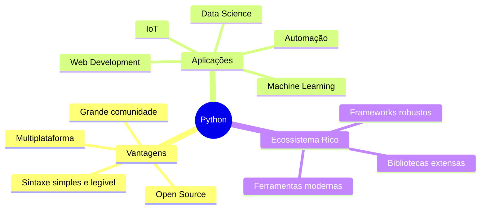

### 1.3 Papel na Ciência de Dados

Python é a linguagem mais popular para Ciência de Dados devido a:

- **Ecossistema robusto**: NumPy, Pandas, Scikit-learn, TensorFlow
- **Visualização poderosa**: Matplotlib, Seaborn, Plotly
- **Notebooks interativos**: Jupyter, Google Colab
- **Integração fácil**: APIs, bancos de dados, big data tools
- **Comunidade ativa**: tutoriais, bibliotecas, suporte

### 1.4 Comparativo com Outras Linguagens

| Característica | Python | R | Julia | MATLAB |
|---------------|--------|---|-------|--------|
| Curva de aprendizado | Suave | Moderada | Moderada | Suave |
| Performance | Boa (com libs otimizadas) | Moderada | Excelente | Boa |
| Comunidade DS | Muito grande | Grande | Crescente | Média |
| Propósito geral | ✅ Sim | ❌ Não | ⚠️ Limitado | ❌ Não |
| Custo | Gratuito | Gratuito | Gratuito | Pago |

---

## 2. Arquitetura Interna do Python

### 2.1 Como o Interpretador Funciona

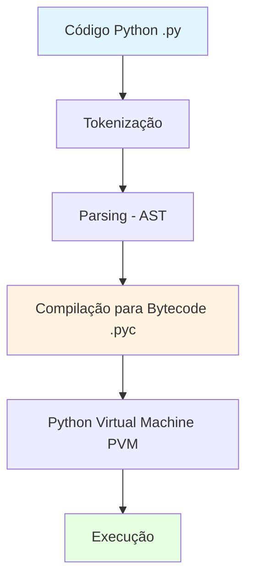

#### Etapas de Execução:

1. **Tokenização**: Código fonte é dividido em tokens (palavras-chave, operadores, identificadores)
2. **Parsing**: Tokens são organizados em uma Árvore Sintática Abstrata (AST)
3. **Compilação**: AST é transformado em bytecode (.pyc)
4. **Execução**: PVM (Python Virtual Machine) executa o bytecode

### 2.2 Ambiente Virtual e Isolamento

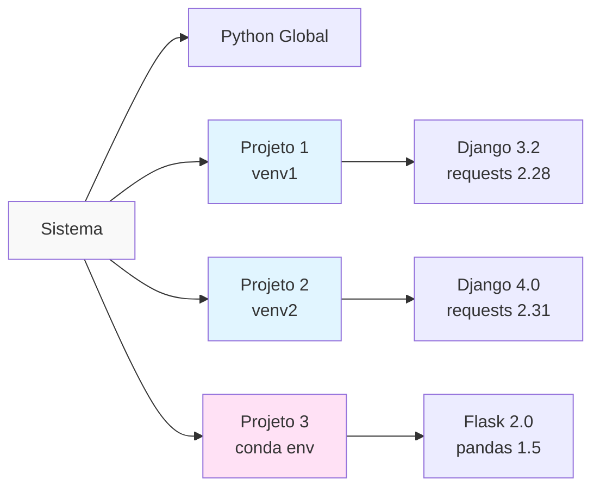

**Por que usar ambientes virtuais?**
- Isolamento de dependências entre projetos
- Evita conflitos de versões
- Reprodutibilidade do ambiente
- Facilita deployment

### 2.3 Gerenciamento de Memória

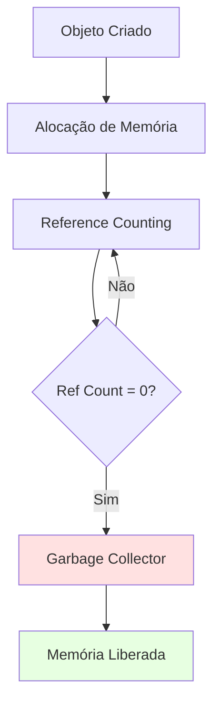

**Principais mecanismos:**
- **Reference Counting**: Conta quantas referências apontam para um objeto
- **Garbage Collector**: Detecta e remove ciclos de referências
- **Gerenciamento automático**: Desenvolvedor não precisa alocar/desalocar manualmente

---

## 3. Fundamentos da Linguagem

### 3.1 Sintaxe Básica

```python
# Variáveis e tipos básicos
nome = "Python"           # str
versao = 3.12            # int
aprovacao = 95.5         # float
ativo = True             # bool

# Estruturas de dados
lista = [1, 2, 3, 4]
tupla = (1, 2, 3)
dicionario = {"chave": "valor"}
conjunto = {1, 2, 3}
```

### 3.2 Controle de Fluxo

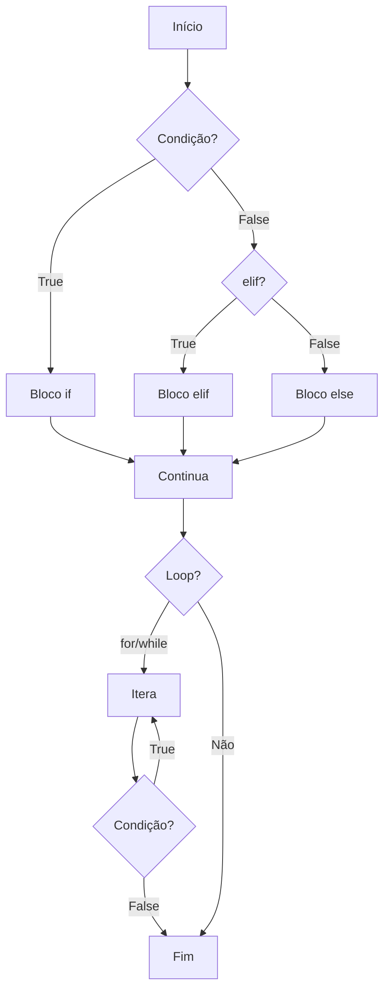

### 3.3 Funções e Módulos

```python
# Definição de função
def processar_dados(dados, filtro=None):
    """
    Processa dados com filtro opcional.

    Args:
        dados: Lista de dados a processar
        filtro: Função de filtro opcional

    Returns:
        Dados processados
    """
    if filtro:
        dados = list(filter(filtro, dados))
    return [d * 2 for d in dados]

# Importação de módulos
import pandas as pd
from sklearn.model_selection import train_test_split
```

### 3.4 Paradigmas de Programação

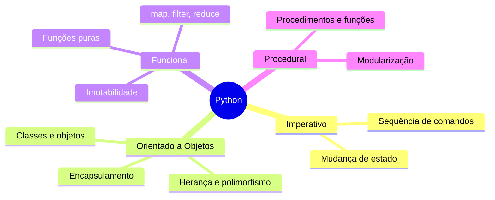

---

## 4. Ambiente e Ecossistema

### 4.1 Ferramentas de Gerenciamento

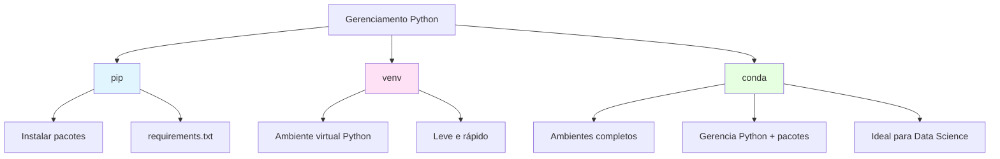

### 4.2 Ambientes de Desenvolvimento

| Ferramenta | Uso | Vantagens |
|------------|-----|-----------|
| **Jupyter Notebook** | Análise interativa | Visualização inline, documentação |
| **Google Colab** | Prototipagem rápida | GPU gratuita, colaboração |
| **VS Code** | Desenvolvimento geral | Extensões, debugging, Git |
| **PyCharm** | Projetos grandes | IDE completa, refactoring |
| **Spyder** | Análise científica | Interface tipo MATLAB |

### 4.3 Estrutura de Projeto

```
meu_projeto/
├── README.md
├── requirements.txt
├── .gitignore
├── setup.py
├── data/
│   ├── raw/
│   └── processed/
├── notebooks/
│   └── exploracao.ipynb
├── src/
│   ├── __init__.py
│   ├── data_processing.py
│   ├── models.py
│   └── visualization.py
└── tests/
    └── test_data_processing.py
```

---

## 5. Python para Ciência de Dados

### 5.1 Stack Essencial

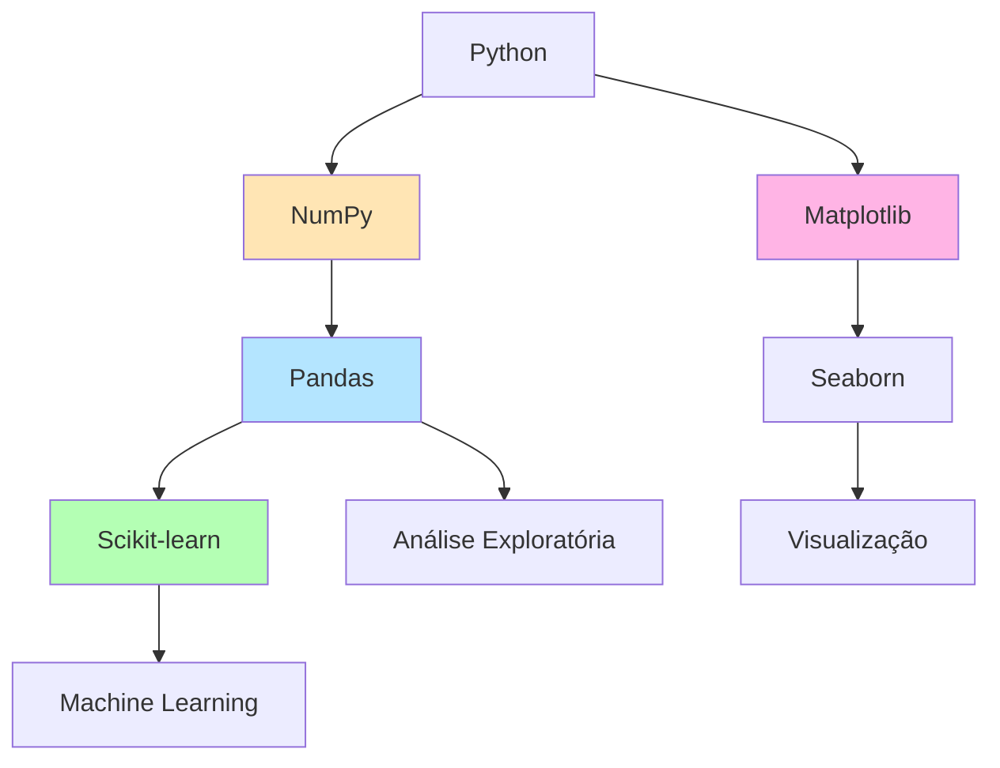

### 5.2 Pipeline de Análise de Dados

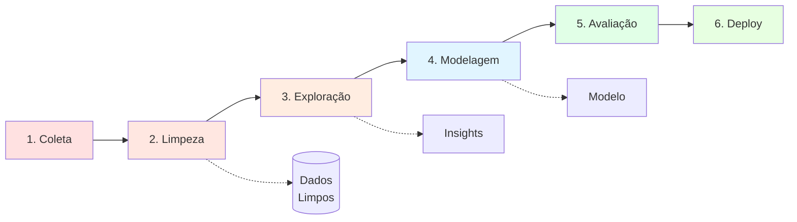

#### Detalhamento do Pipeline:

1. **Coleta**: APIs, arquivos CSV/JSON, bancos de dados, web scraping
2. **Limpeza**: Valores faltantes, outliers, normalização, encoding
3. **Exploração**: Estatísticas descritivas, correlações, visualizações
4. **Modelagem**: Feature engineering, treino, tuning de hiperparâmetros
5. **Avaliação**: Métricas, validação cruzada, análise de erros
6. **Deploy**: API, dashboard, relatórios automatizados

### 5.3 Bibliotecas Principais

#### NumPy - Computação Numérica
```python
import numpy as np

# Arrays multidimensionais
arr = np.array([[1, 2, 3], [4, 5, 6]])
print(arr.shape)  # (2, 3)

# Operações vetorizadas
resultado = arr * 2 + 10
```

#### Pandas - Manipulação de Dados
```python
import pandas as pd

# DataFrame
df = pd.DataFrame({
    'nome': ['Ana', 'Bruno', 'Carlos'],
    'idade': [25, 30, 35],
    'salario': [3000, 4000, 5000]
})

# Operações
media_idade = df['idade'].mean()
filtrado = df[df['salario'] > 3500]
```

#### Matplotlib - Visualização
```python
import matplotlib.pyplot as plt

# Gráfico simples
plt.plot([1, 2, 3, 4], [1, 4, 9, 16])
plt.xlabel('X')
plt.ylabel('Y')
plt.title('Meu Gráfico')
plt.show()
```

### 5.4 Projeto Demonstrativo: Dataset Titanic

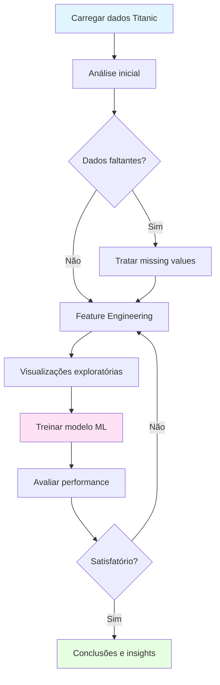

**Objetivos do projeto:**
- Prever sobrevivência de passageiros
- Identificar fatores de risco
- Demonstrar pipeline completo
- Boas práticas de documentação

---

## 6. Encerramento e Próximos Passos

### 6.1 Recursos de Aprendizado

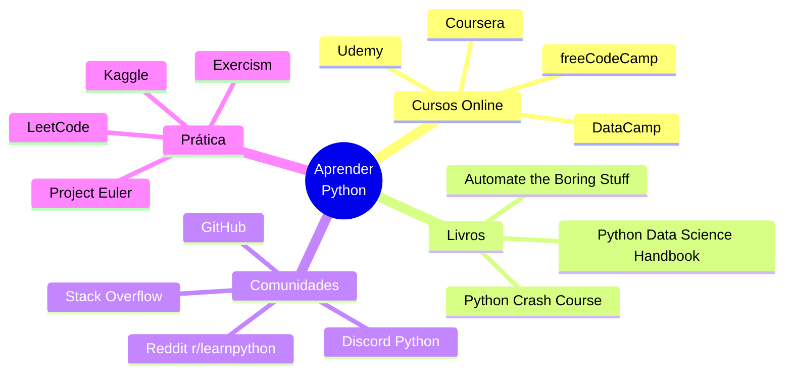

### 6.2 Roadmap de Carreira em Data Science

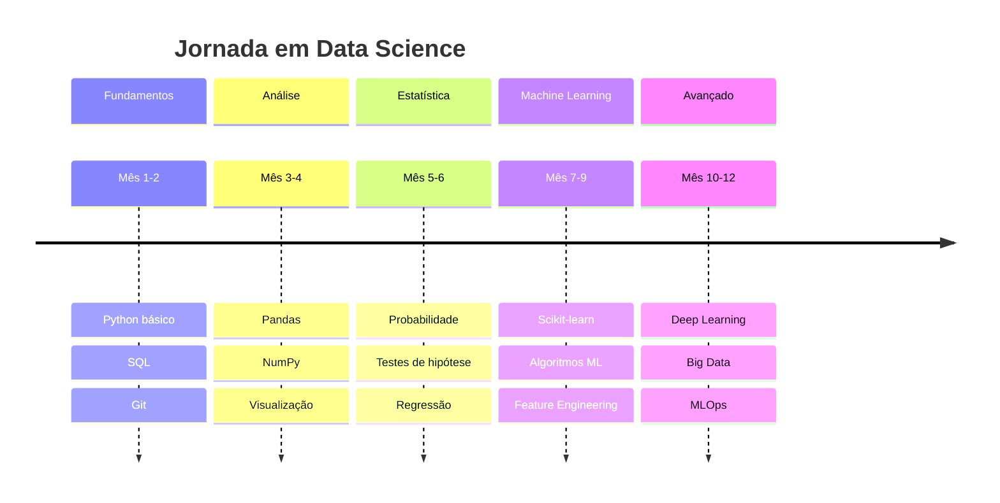

### 6.3 Dicas de Carreira

1. **Construa um portfólio**: Projetos no GitHub, Kaggle, blog técnico
2. **Contribua com open source**: Aprenda com código real
3. **Networking**: Participe de meetups, conferências, comunidades
4. **Mantenha-se atualizado**: Papers, blogs, podcasts
5. **Pratique comunicação**: Explicar insights é tão importante quanto encontrá-los

### 6.4 Atividade Final

**Notebook de Exploração de Dados - Dataset Titanic**

Tarefas:
- [ ] Carregar o dataset do Titanic
- [ ] Realizar análise exploratória de dados (EDA)
- [ ] Criar pelo menos 3 visualizações diferentes
- [ ] Identificar padrões e correlações
- [ ] Tratar dados faltantes
- [ ] Criar features novas
- [ ] Treinar modelo de classificação simples
- [ ] Documentar insights e conclusões

**Critérios de avaliação:**
- Qualidade do código (legibilidade, organização)
- Profundidade da análise
- Visualizações informativas
- Insights relevantes
- Documentação clara

---

## 📚 Referências e Links Úteis

- [Documentação Oficial Python](https://docs.python.org/3/)
- [Python Data Science Handbook](https://jakevdp.github.io/PythonDataScienceHandbook/)
- [Kaggle Learn](https://www.kaggle.com/learn)
- [Real Python Tutorials](https://realpython.com/)
- [Towards Data Science](https://towardsdatascience.com/)

---

## 💡 Citações Inspiradoras

> "A simplicidade é o mais alto grau de sofisticação." - Leonardo da Vinci

> "Dados são o novo petróleo, mas apenas se refinados." - Clive Humby

> "O Python é poderoso... e rápido; brinca bem com os outros; roda em todo lugar; é amigável e fácil de aprender." - Python.org

---

**Última atualização**: 2025-10-17
**Próxima aula**: Manipulação Avançada de Dados com Pandas
