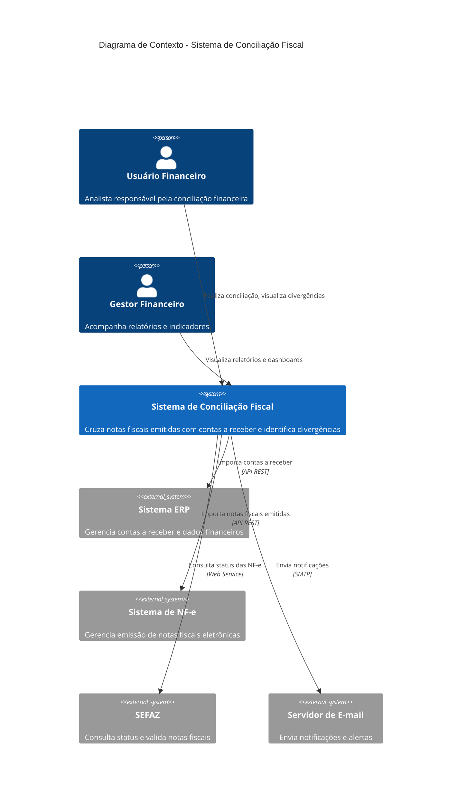
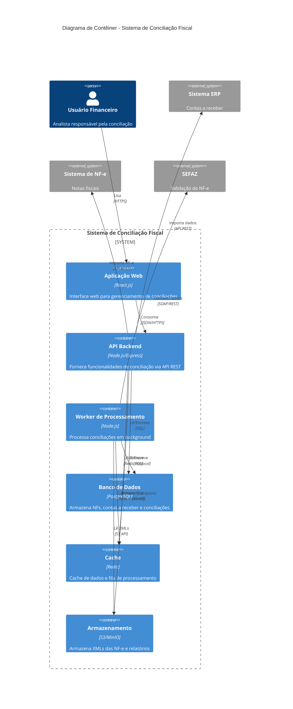
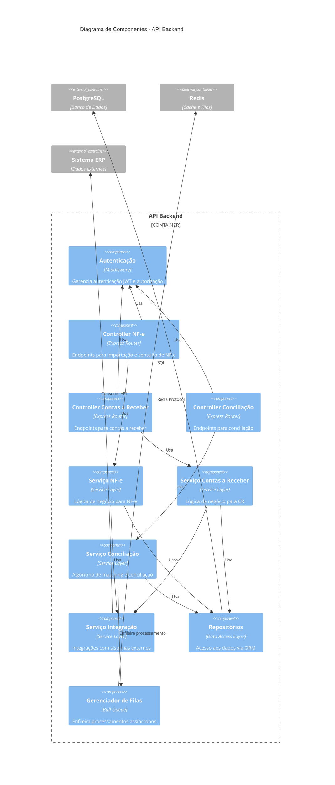

# Proposta de Arquitetura C4 - Sistema de Conciliação de Notas Fiscais

## Visão Geral
Sistema para cruzamento automático de notas fiscais emitidas com o contas a receber, permitindo identificar divergências, confirmar recebimentos e facilitar a reconciliação financeira.

---

## Nível 1: Diagrama de Contexto

---

## Nível 2: Diagrama de Contêiner

---

## Nível 3: Diagrama de Componentes (API Backend)

---

## Descrição dos Componentes Principais

### Frontend (Aplicação Web)
- **Tecnologia**: React.js com TypeScript
- **Funcionalidades**:
  - Dashboard com indicadores de conciliação
  - Listagem de NF-e e Contas a Receber
  - Interface de matching manual
  - Visualização de divergências
  - Exportação de relatórios

### Backend (API)
- **Tecnologia**: Node.js com Express
- **Responsabilidades**:
  - Importação de dados do ERP e NF-e
  - Algoritmo de matching automático
  - Gerenciamento de regras de conciliação
  - Exposição de APIs REST
  - Validação de dados

### Worker de Processamento
- **Tecnologia**: Node.js
- **Responsabilidades**:
  - Processamento assíncrono de conciliações em lote
  - Consulta periódica ao SEFAZ
  - Geração de relatórios
  - Envio de notificações

### Banco de Dados
- **Tecnologia**: PostgreSQL
- **Entidades Principais**:
  - NotasFiscais
  - ContasReceber
  - Conciliacoes
  - Divergencias
  - Usuarios
  - ConfiguracoesRegras

---

## Fluxo de Conciliação

1. **Importação**: Sistema importa NF-e e Contas a Receber dos sistemas externos
2. **Matching Automático**: Algoritmo cruza os dados baseado em regras configuráveis:
   - Número da NF-e
   - CNPJ do cliente
   - Valor
   - Data de emissão/vencimento
3. **Identificação de Divergências**: Sistema identifica:
   - NF-e sem CR correspondente
   - CR sem NF-e
   - Diferenças de valor
   - Diferenças de data
4. **Conciliação Manual**: Usuário pode fazer matching manual de itens não conciliados
5. **Relatórios**: Geração de relatórios de conciliação e divergências

---

## Tecnologias Sugeridas

### Frontend
- React.js / Next.js
- TypeScript
- TailwindCSS ou Material-UI
- Chart.js para gráficos

### Backend
- Node.js com Express ou NestJS
- TypeScript
- Prisma ou TypeORM
- Bull para filas

### Infraestrutura
- PostgreSQL 14+
- Redis 6+
- MinIO ou AWS S3
- Docker / Docker Compose
- Nginx como reverse proxy

---

## Próximos Passos

1. Validar requisitos funcionais detalhados
2. Definir regras de matching/conciliação
3. Modelar banco de dados completo
4. Criar protótipos de telas
5. Implementar MVP com funcionalidades core
